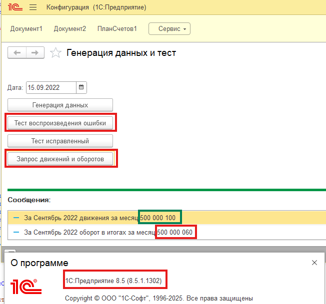
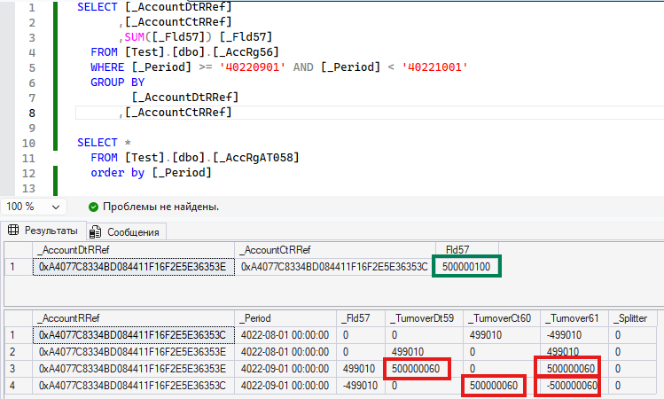
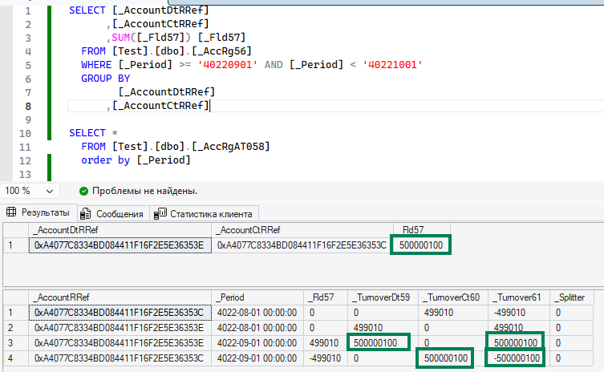

# Расхождения бухгалтерских итогов при перестановке границы

## Пример конфигурации для воспроизведения ошибки при перестановке границы итогов для регистров бухгалтерии.

Есть уже собранные логи технологического журнала, если нет возможности разворачивать тестовый стенд.

Файл лога с воспроизведением ошибки 
Файл лога с исправленной ошибкой 

Для воспроизведения ошибки при перестановке границы итогов для регистров бухгалтерии необходима платформа 1С например 8.3 или 8.5.
1. Загрузить конфигурацию из файлов из каталога src.
2. В обработке нажать один раз "Генерация данных" (занимает несколько часов).

3. После нажатия "Тест воспроизведения ошибки" и "Запрос движений и оборотов" будет выведено две отличающиеся суммы движений и оборота из итогов.

На СУБД

4. После нажатия "Тест исправленный" и "Запрос движений и оборотов" будет выведено две совпадающие суммы движений и оборота из итогов.

На СУБД

