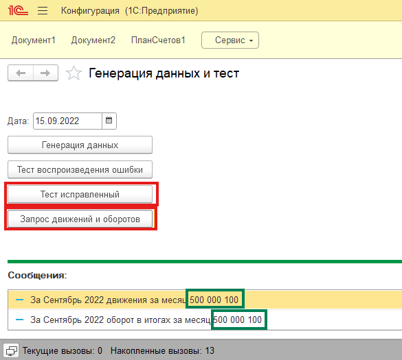

# Расхождения бухгалтерских итогов при перестановке границы

# Пример конфигурации для воспроизведения ошибки при перестановке границы итогов для регистров бухгалтерии.
Для воспроизведения ошибки при перестановке границы итогов для регистров бухгалтерии необходима платформа 1С например 8.3 или 8.5.
1. Загрузить конфигурацию из файлов из каталога src.
2. В обработке нажать один раз "Генерация данных".

3. После нажатия "Тест воспроизведения ошибки" и "Запрос движений и оборотов" будет выведено две отличающиеся суммы движений и оборота из итогов.

На СУБД

_AccountRRef						_Period				_Fld39	_TurnoverDt41	_TurnoverCt42	_Turnover43	_Splitter
0xA22F00155D039A5411ED4ED0F8016D24	4022-09-01 00:00:00	0		0				100000			-100000		0
0xA22F00155D039A5411ED4ED0F8016D24	4022-10-01 00:00:00	-99990	0				0				0			0
0xA22F00155D039A5411ED4ED0F8016D24	5999-11-01 00:00:00	-100000	0				0				0			0
0xA22F00155D039A5411ED4ED0F8016D26	4022-09-01 00:00:00	0		100000			0				100000		0
0xA22F00155D039A5411ED4ED0F8016D26	4022-10-01 00:00:00	99990	0				0				0			0
0xA22F00155D039A5411ED4ED0F8016D26	5999-11-01 00:00:00	100000	0				0				0			0

4. После нажатия "Тест исправленный" и "Запрос движений и оборотов" будет выведено две совпадающие суммы движений и оборота из итогов.

На СУБД

_AccountRRef						_Period				_Fld39	_TurnoverDt41	_TurnoverCt42	_Turnover43	_Splitter
0xA22F00155D039A5411ED4ED0F8016D24	4022-09-01 00:00:00	0		0				100000			-100000		0
0xA22F00155D039A5411ED4ED0F8016D24	4022-10-01 00:00:00	-100000	0				0				0			0
0xA22F00155D039A5411ED4ED0F8016D24	5999-11-01 00:00:00	-100000	0				0				0			0
0xA22F00155D039A5411ED4ED0F8016D26	4022-09-01 00:00:00	0		100000			0				100000		0
0xA22F00155D039A5411ED4ED0F8016D26	4022-10-01 00:00:00	100000	0				0				0			0
0xA22F00155D039A5411ED4ED0F8016D26	5999-11-01 00:00:00	100000	0				0				0			0

