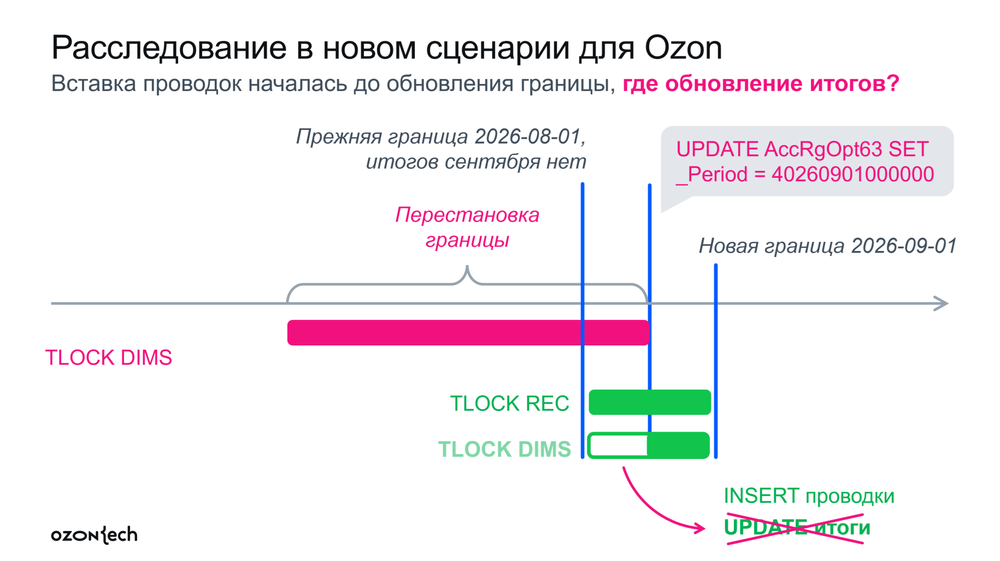
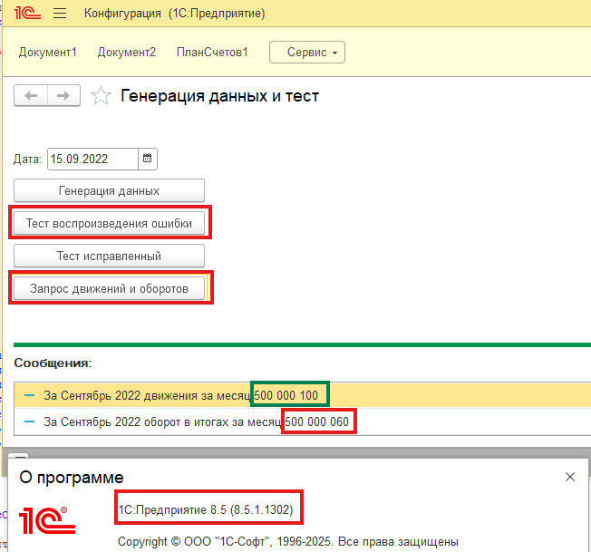
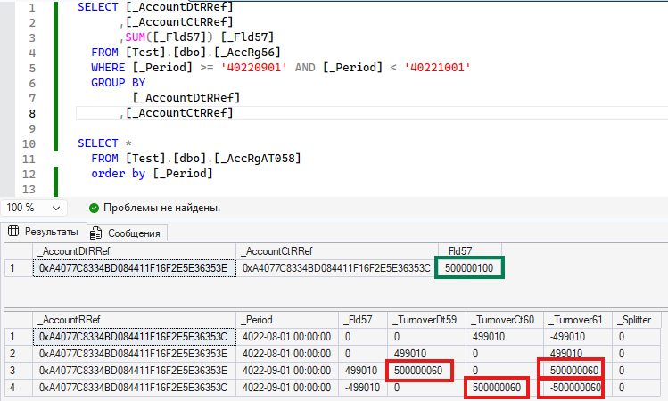
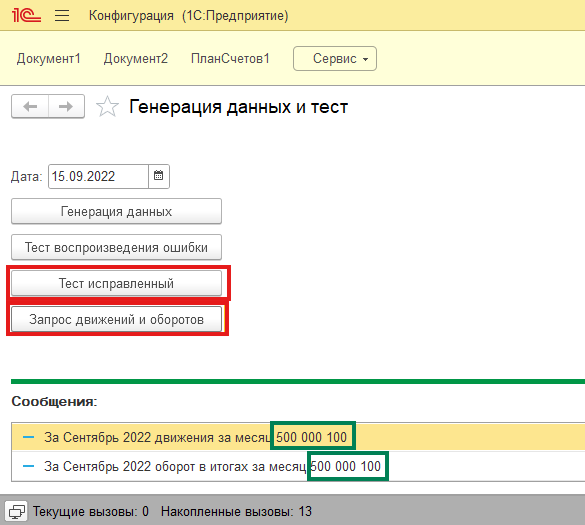
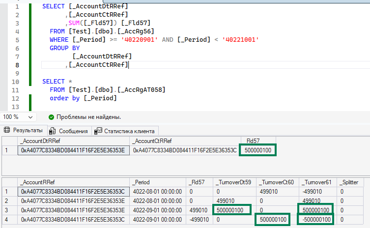

# Расхождения бухгалтерских итогов при перестановке границы

## Пример конфигурации для воспроизведения ошибки при перестановке границы итогов для регистров бухгалтерии.

### Если нет возможности или желания разворачивать тестовый стенд, то подготовил собранные логи технологического журнала.

1. Файл лога с воспроизведением ошибки 

 $\color{magenta}{TLOCK\ DIMS}$ 

05:26.532039-3,TLOCK,4,level=INFO,process=rphost,p:processName=test,OSThread=4120,t:clientID=435,t:applicationName=1CV8C,t:computerName=rilink,t:connectID=28,SessionID=2,Usr=DefUser,AppID=1CV8C,DBMS=DBMSSQL,DataBase=127.0.0.1\test,Regions=AccRg56.DIMS,Locks='AccRg56.DIMS Exclusive Period=[T"00010101000000":T"20220901000000"]',WaitConnections=,Context='Форма.Вызов : Обработка.ГенерацияДанныхИТест.Форма.Форма.Модуль.ТестВоспроизведенияОшибкиНаСервере
Обработка.ГенерацияДанныхИТест.Форма.Форма.Форма : 165 : ПереставитьГраницуВФоне.ПереставитьГраницуВФонеСБлокировкой(КонецМесяца(ДобавитьМесяц(ДатаТеста,-1)));
	ОбщийМодуль.ПереставитьГраницуВФоне.Модуль : 20 : РегистрыБухгалтерии.РегистрБухгалтерии1.УстановитьМаксимальныйПериодРассчитанныхИтогов(ДатаИтогов);'

 $\color{lime}{TLOCK\ REC}$ 

06:26.798029-5,TLOCK,4,level=INFO,process=rphost,p:processName=test,OSThread=4120,t:clientID=435,t:applicationName=1CV8C,t:computerName=rilink,t:connectID=28,SessionID=2,Usr=DefUser,AppID=1CV8C,DBMS=DBMSSQL,DataBase=127.0.0.1\test,Regions=AccRg56.RECORDER,Locks='AccRg56.RECORDER Exclusive Recorder=65:a4077c8334bd084411f17006c7852299',WaitConnections=,Context='Форма.Вызов : Обработка.ГенерацияДанныхИТест.Форма.Форма.Модуль.ТестВоспроизведенияОшибкиНаСервере
Обработка.ГенерацияДанныхИТест.Форма.Форма.Форма : 190 : Набор.Записать();'

 $\color{magenta}{UPDATE\ AccRgOpt\ SET\ Period\ =\ 40260901 }$ 

06:37.440010-3,TLOCK,4,level=INFO,process=rphost,p:processName=test,OSThread=8264,t:clientID=438,t:applicationName=BackgroundJob,t:computerName=rilink,t:connectID=30,SessionID=3,Usr=DefUser,DBMS=DBMSSQL,DataBase=127.0.0.1\test,Regions=AccRgOpt63,Locks='AccRgOpt63 Exclusive RegID=4B8A3D3E5D0A3D489F6B3041A662E25D',WaitConnections=,Context='
ОбщийМодуль.ПереставитьГраницуВФоне.Модуль : 6 : РегистрыБухгалтерии.РегистрБухгалтерии1.УстановитьМаксимальныйПериодРассчитанныхИтогов(ДатаИтогов);'
06:37.440013-1,DBMSSQL,5,level=DEBUG,process=rphost,p:processName=test,OSThread=8264,t:clientID=438,t:applicationName=BackgroundJob,t:computerName=rilink,t:connectID=30,SessionID=3,Usr=DefUser,DBMS=DBMSSQL,DataBase=127.0.0.1\test,Trans=1,dbpid=51,Sql='UPDATE T1 SET _Period = ?
FROM dbo._AccRgOpt63 T1
WHERE T1._RegID = ?
p_0: 40220901000000
p_1: 0x4B8A3D3E5D0A3D489F6B3041A662E25D
',Rows=0,RowsAffected=1,Context='
ОбщийМодуль.ПереставитьГраницуВФоне.Модуль : 6 : РегистрыБухгалтерии.РегистрБухгалтерии1.УстановитьМаксимальныйПериодРассчитанныхИтогов(ДатаИтогов);'

 $\color{lime}{TLOCK\ DIMS}$ 

06:37.456017-10657979,TLOCK,4,level=INFO,process=rphost,p:processName=test,OSThread=4120,t:clientID=435,t:applicationName=1CV8C,t:computerName=rilink,t:connectID=28,SessionID=2,Usr=DefUser,AppID=1CV8C,DBMS=DBMSSQL,DataBase=127.0.0.1\test,Regions=AccRg56.DIMS,Locks='AccRg56.DIMS Exclusive Correspond=0 Period=T"20220901000000" Splitter=0 Account=53:a4077c8334bd084411f16f2e5e36353e, Correspond=0 Period=T"20220901000000" Splitter=0 Account=53:a4077c8334bd084411f16f2e5e36353e, Correspond=0 Period=T"20220901000000" Splitter=0 Account=53:a4077c8334bd084411f16f2e5e36353e, Correspond=0 Period=T"20220901000000" Splitter=0 Account=53:a4077c8334bd084411f16f2e5e36353e, Correspond=0 Period=T"20220901000000" Splitter=0 Account=53:a4077c8334bd084411f16f2e5e36353e, Correspond=0 Period=T"20220901000000" Splitter=0 Account=53:a4077c8334bd084411f16f2e5e36353e, Correspond=0 Period=T"20220901000000" Splitter=0 Account=53:a4077c8334bd084411f16f2e5e36353e, Correspond=0 Period=T"20220901000000" Splitter=0 Account=53:a4077c8334bd084411f16f2e5e36353e, Correspond=0 Period=T"20220901000000" Splitter=0 Account=53:a4077c8334bd084411f16f2e5e36353e, Correspond=0 Period=T"20220901000000" Splitter=0 Account=53:a4077c8334bd084411f16f2e5e36353e,AccRg56.DIMS Exclusive Correspond=1 Period=T"20220901000000" Splitter=0 Account=53:a4077c8334bd084411f16f2e5e36353c, Correspond=1 Period=T"20220901000000" Splitter=0 Account=53:a4077c8334bd084411f16f2e5e36353c, Correspond=1 Period=T"20220901000000" Splitter=0 Account=53:a4077c8334bd084411f16f2e5e36353c, Correspond=1 Period=T"20220901000000" Splitter=0 Account=53:a4077c8334bd084411f16f2e5e36353c, Correspond=1 Period=T"20220901000000" Splitter=0 Account=53:a4077c8334bd084411f16f2e5e36353c, Correspond=1 Period=T"20220901000000" Splitter=0 Account=53:a4077c8334bd084411f16f2e5e36353c, Correspond=1 Period=T"20220901000000" Splitter=0 Account=53:a4077c8334bd084411f16f2e5e36353c, Correspond=1 Period=T"20220901000000" Splitter=0 Account=53:a4077c8334bd084411f16f2e5e36353c, Correspond=1 Period=T"20220901000000" Splitter=0 Account=53:a4077c8334bd084411f16f2e5e36353c, Correspond=1 Period=T"20220901000000" Splitter=0 Account=53:a4077c8334bd084411f16f2e5e36353c',WaitConnections=30,connectionID=da41581d-154a-4918-a4fc-234c566a6db5,Context='Форма.Вызов : Обработка.ГенерацияДанныхИТест.Форма.Форма.Модуль.ТестВоспроизведенияОшибкиНаСервере
Обработка.ГенерацияДанныхИТест.Форма.Форма.Форма : 190 : Набор.Записать();'

 $\color{lime}{INSERT\ проводки}$ 

06:37.471032-1,DBMSSQL,5,level=DEBUG,process=rphost,p:processName=test,OSThread=4120,t:clientID=435,t:applicationName=1CV8C,t:computerName=rilink,t:connectID=28,SessionID=2,Usr=DefUser,AppID=1CV8C,DBMS=DBMSSQL,DataBase=127.0.0.1\test,Trans=1,dbpid=53,Sql='INSERT INTO dbo._AccRg56 (_Period,_RecorderTRef,_RecorderRRef,_LineNo,_Active,_AccountDtRRef,_AccountCtRRef,_Fld57) VALUES(?,?,?,?,?,?,?,?)',Prm='
p_0: 40220915082003
p_1: 0x00000041
p_2: 0xA4077C8334BD084411F17006C7852299
p_3: 1N
p_4: TRUE
p_5: 0xA4077C8334BD084411F16F2E5E36353E
p_6: 0xA4077C8334BD084411F16F2E5E36353C
p_7: -930N

p_0: 40220915082003
p_1: 0x00000041
p_2: 0xA4077C8334BD084411F17006C7852299
p_3: 2N
p_4: TRUE
p_5: 0xA4077C8334BD084411F16F2E5E36353E
p_6: 0xA4077C8334BD084411F16F2E5E36353C
p_7: 10N

p_0: 40220915082003
p_1: 0x00000041
p_2: 0xA4077C8334BD084411F17006C7852299
p_3: 3N
p_4: TRUE
p_5: 0xA4077C8334BD084411F16F2E5E36353E
p_6: 0xA4077C8334BD084411F16F2E5E36353C
p_7: 10N

p_0: 40220915082003
p_1: 0x00000041
p_2: 0xA4077C8334BD084411F17006C7852299
p_3: 4N
p_4: TRUE
p_5: 0xA4077C8334BD084411F16F2E5E36353E
p_6: 0xA4077C8334BD084411F16F2E5E36353C
p_7: 10N

p_0: 40220915082003
p_1: 0x00000041
p_2: 0xA4077C8334BD084411F17006C7852299
p_3: 5N
p_4: TRUE
p_5: 0xA4077C8334BD084411F16F2E5E36353E
p_6: 0xA4077C8334BD084411F16F2E5E36353C
p_7: 10N

p_0: 40220915082003
p_1: 0x00000041
p_2: 0xA4077C8334BD084411F17006C7852299
p_3: 6N
p_4: TRUE
p_5: 0xA4077C8334BD084411F16F2E5E36353E
p_6: 0xA4077C8334BD084411F16F2E5E36353C
p_7: 10N

p_0: 40220915082003
p_1: 0x00000041
p_2: 0xA4077C8334BD084411F17006C7852299
p_3: 7N
p_4: TRUE
p_5: 0xA4077C8334BD084411F16F2E5E36353E
p_6: 0xA4077C8334BD084411F16F2E5E36353C
p_7: 10N

p_0: 40220915082003
p_1: 0x00000041
p_2: 0xA4077C8334BD084411F17006C7852299
p_3: 8N
p_4: TRUE
p_5: 0xA4077C8334BD084411F16F2E5E36353E
p_6: 0xA4077C8334BD084411F16F2E5E36353C
p_7: 10N

p_0: 40220915082003
p_1: 0x00000041
p_2: 0xA4077C8334BD084411F17006C7852299
p_3: 9N
p_4: TRUE
p_5: 0xA4077C8334BD084411F16F2E5E36353E
p_6: 0xA4077C8334BD084411F16F2E5E36353C
p_7: 10N

p_0: 40220915082003
p_1: 0x00000041
p_2: 0xA4077C8334BD084411F17006C7852299
p_3: 10N
p_4: TRUE
p_5: 0xA4077C8334BD084411F16F2E5E36353E
p_6: 0xA4077C8334BD084411F16F2E5E36353C
p_7: 10N
',RowsAffected=10,Context='Форма.Вызов : Обработка.ГенерацияДанныхИТест.Форма.Форма.Модуль.ТестВоспроизведенияОшибкиНаСервере
Обработка.ГенерацияДанныхИТест.Форма.Форма.Форма : 190 : Набор.Записать();'

	
2. Файл лога с исправленной ошибкой 

### Для воспроизведения ошибки при перестановке границы итогов для регистров бухгалтерии необходима платформа 1С например 8.3 или 8.5.
1. Загрузить конфигурацию из файлов из каталога src.
2. Желательно настроить сбор технологического журнала, файл с настройками 
3. В обработке нажать один раз "Генерация данных" (занимает несколько часов).

4. После нажатия "Тест воспроизведения ошибки" и после завершения "Запрос движений и оборотов" будет выведено две отличающиеся суммы движений и оборота из итогов.

На СУБД

5. После нажатия "Тест исправленный" и после завершения "Запрос движений и оборотов" будет выведено две совпадающие суммы движений и оборота из итогов.

На СУБД

